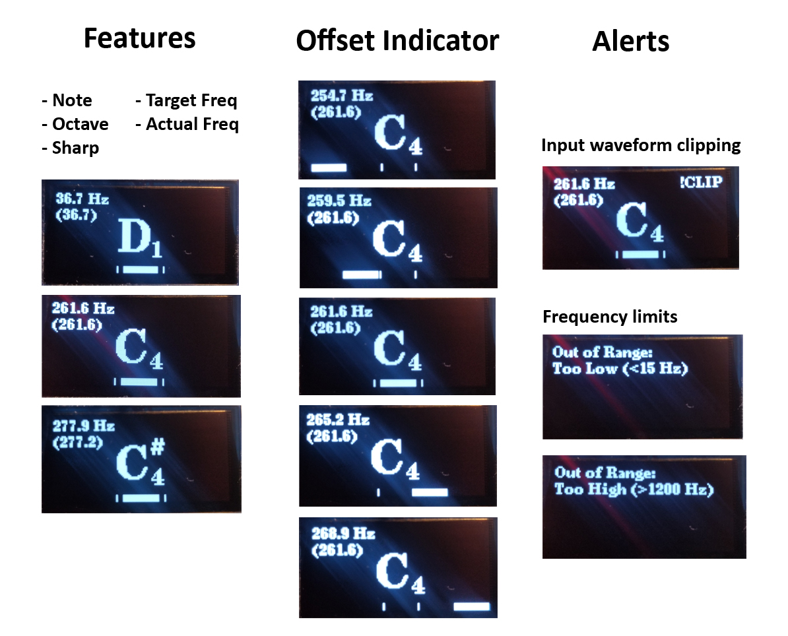
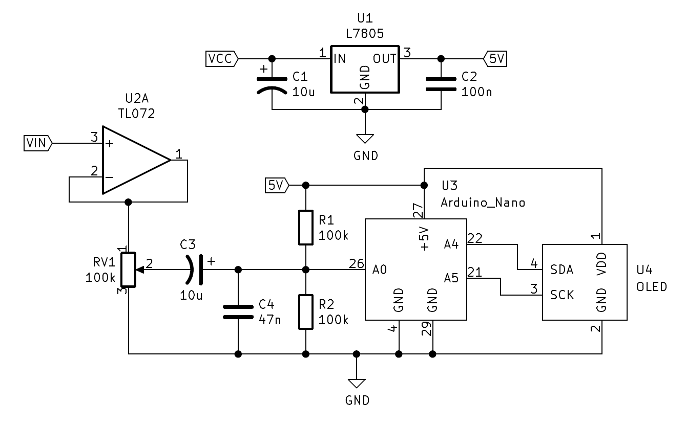

# Arduino OLED Musical Note Tuner

ATMEGA328 based musical note tuner using an i2c OLED display (SSD1306 / SH1106).

## Platform.io Setup

## TODO (Add documentation on the following)

* Description of what this is (and what it is NOT)
* Biasing the input (show example circuit)
* OLED Setup + libraries
* Range and limitations (high as C6, low as D0), recommended range is C1-C6; more accurate at lower freqs
* Display features
  * clipping warning (also "L" LED beneath power on arduino itself)
  * actual frequency
  * target frequency
  * octave
  * note
  * sharp
  * tuning indicator
* Customizing the display
* frequency smoothing option

